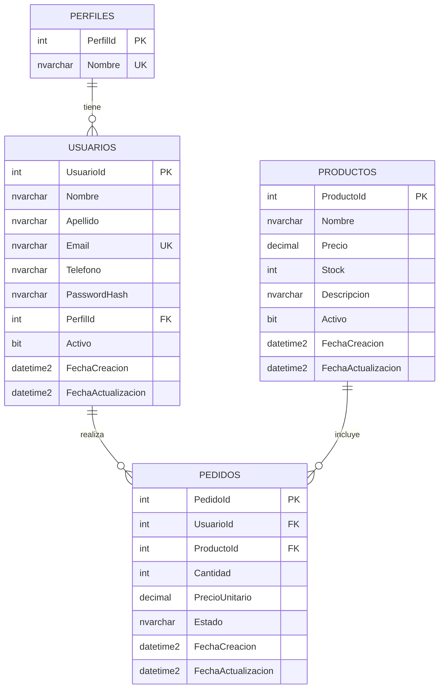

# Diagrama de base de datos

Base `CafeteriaCampus`. Cada usuario tiene un perfil. Cada pedido depende de un usuario y de un producto.

```mermaid
erDiagram
    PERFILES ||--o{ USUARIOS : tiene
    USUARIOS ||--o{ PEDIDOS : realiza
    PRODUCTOS ||--o{ PEDIDOS : incluye

    PERFILES {
        int PerfilId PK
        nvarchar Nombre UK
    }

    USUARIOS {
        int UsuarioId PK
        nvarchar Nombre
        nvarchar Apellido
        nvarchar Email UK
        nvarchar Telefono
        nvarchar PasswordHash
        int PerfilId FK
        bit Activo
        datetime2 FechaCreacion
        datetime2 FechaActualizacion
    }

    PRODUCTOS {
        int ProductoId PK
        nvarchar Nombre
        decimal Precio
        int Stock
        nvarchar Descripcion
        bit Activo
        datetime2 FechaCreacion
        datetime2 FechaActualizacion
    }

    PEDIDOS {
        int PedidoId PK
        int UsuarioId FK
        int ProductoId FK
        int Cantidad
        decimal PrecioUnitario
        nvarchar Estado
        datetime2 FechaCreacion
        datetime2 FechaActualizacion
    }
```
